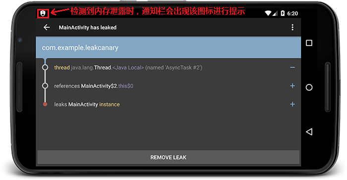
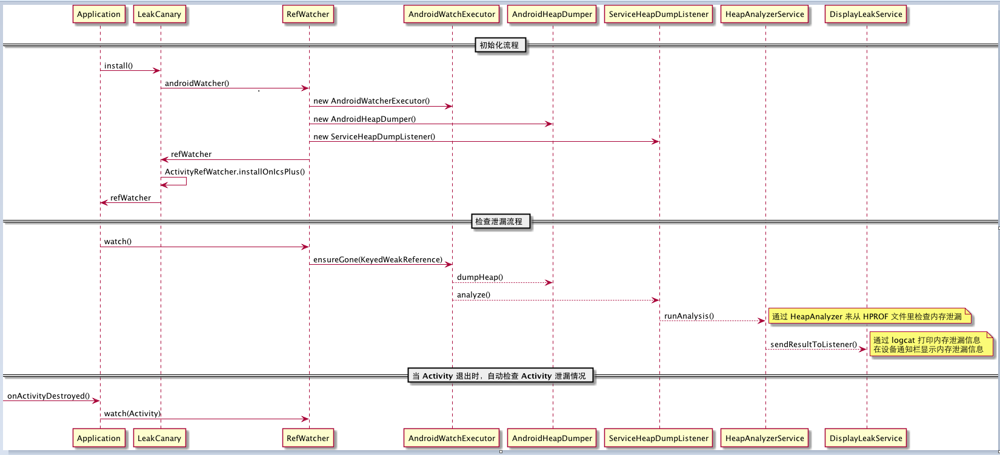
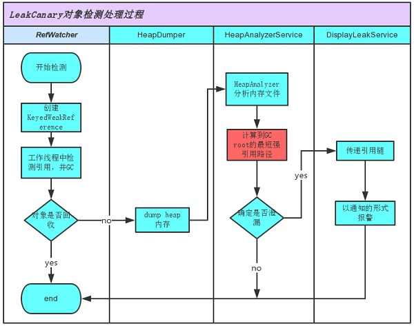
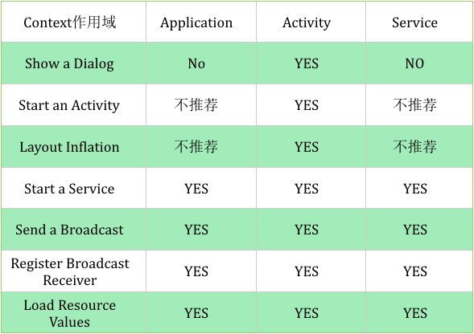

# 内存优化day01 

## 前言

为什么内存优化？

在一个商业项目中，很有可能因为工程师的疏忽，导致代码质量不佳，影响到程序的运行效率，从而让用户感知到应用的卡顿、崩溃。而Android开发中，每个Android应用在手机上申请的内存空间都是有限的。虽然手机发展越来越快，可申请到的内存越来越大，但是也不能大手大脚，随便浪费应用可使用的内存空间。内存一旦不够时，你这个应用就会因为OOM（out of memory）而崩溃。因此，内存优化这一块内容，在开发应用时是非常重要的。

## 1 内存优化的关键点—避免内存泄露

内存优化中非常关键的一点，就是避免内存泄露。因为内存泄露会严重的导致内存浪费，所以避免内存泄露，是内存优化中必不可少的。

## 2 java中的四种引用类型

java引用类型不是指像int、char等这些基本的数据类型。java中的引用类型有四种：强引用、软引用、弱引用、虚引用。这四种引用类型，它们关于对象的可及性是由强到弱的。

### 2.1强引用

最常见的强引用方式如下：

```java
		//强引用  对象类型 对象名 = new 对象构造方法();
		//比如下列代码
		String str = new String("abc");
```

在上述代码中，这个str对象就是强可及对象。**强可及对象永远不会被GC回收。**它宁愿被抛出OOM异常，也不会回收掉强可及对象。

清除强引用对象中的引用链如下：

```java
		String str = new String("abc");
		//置空
		str = null;
```

### 2.2 软应用

软引用方式如下：

```java
		//软引用SoftReference
		SoftReference<String> softReference = new SoftReference<String>(str);
```

在上述代码中，这个str对象就是软可及对象。**当系统内存不足时，软可及对象会被GC回收。**

清除软引用对象中的引用链可以通过模拟系统内存不足来清除，也可以手动清除，手动清除如下：

```java
		SoftReference<String> softReference = new SoftReference<String>(str);
		softReference.clear();
```

### 2.3 弱引用

弱引用方式如下：

```java
		//弱引用WeakReference
		WeakReference<String> weakReference = new WeakReference<>(str);
```

在上述代码中，这个str对象就是弱可及对象。**当每次GC时，弱可及对象就会被回收。**

清除弱引用对象中的引用链可以通过手动调用gc代码来清除，如下：

```java
		WeakReference<String> weakReference = new WeakReference<>(str);
		System.gc();
```

当然，也可以通过类似软引用，调用clear()方法也可以。

### 2.4 虚引用

虚引用方式如下：

```java
		//虚引用PhantomReference
		PhantomReference phantomReference = new PhantomReference<>(arg0, arg1);
```

虚引用一般在代码中出现的频率极低，主要目的是为了检测对象是否已经被系统回收。它在一些用来检测内存是否泄漏的开源项目中使用到过，如LeakCanary。

### 2.5 补充

* 一个对象的可及性由最强的那个来决定。 


* System.gc()方法只会回收堆内存中存放的对象。

```java
		String str = "abc";
		//弱引用WeakReference
		WeakReference<String> weakReference = new WeakReference<>(str);
		System.gc();
```

​	像这样的代码，即使gc后，str对象仍然可以通过弱引用拿到。因为像"abc"这种，并没有存放在堆内	存中，它被存放在常量池里，所以gc不会去回收。

## 3 内存泄露的原因

**对无用对象的引用一直未被释放，就会导致内存泄露。**如果对象已经用不到了，但是因为疏忽，导致代码中对该无用对象的引用一直没有被清除掉，就会造成内存泄露。

比如你按back键关掉了一个Activity，那么这个Activity页面就暂时没用了。但是某个后台任务如果一直持有着对该Activity对象的引用，这个时候就会导致内存泄露。

## 4 检测内存泄露—LeakCanary

在全球最大的同性交友网站[github](http://www.github.com)中，有一个非常流行的开源项目[LeakCanary](https://github.com/square/leakcanary)，它能很方便的检测到当前开发的java项目中是否存在内存泄露。

## 5 LeakCanary的使用

### 5.1 官方使用文档描述

从LeakCanary的文档描述中，可以得知使用方式，简单翻译为如下步骤：

1. 在你的项目中，找到moudle级别的build.gradle文件，并在dependencies标签里加上以下代码：

   ```xml
    dependencies {
   	//... 你项目中以前声明的一些依赖
      debugCompile 'com.squareup.leakcanary:leakcanary-android:1.5'
      releaseCompile 'com.squareup.leakcanary:leakcanary-android-no-op:1.5'
      testCompile 'com.squareup.leakcanary:leakcanary-android-no-op:1.5'
    }
   ```

2. 在你Android项目中，找到先前写的Application类（PS：如果没有，那么请自行新建并在AndroidManifest中声明），并添加如下代码：

   ```java
   public class ExampleApplication extends Application {

     @Override public void onCreate() {
       super.onCreate();
       if (LeakCanary.isInAnalyzerProcess(this)) {
         // This process is dedicated to LeakCanary for heap analysis.
         // You should not init your app in this process.
         return;
       }
       LeakCanary.install(this);
       // Normal app init code...
     }
   }
   ```

3. 导入完毕！当你的应用出现内存泄露时，LeakCanary会在通知栏上进行通知，注意查看。下图是一个LeakCanary检测到内存泄露时的实示例。
   

### 5.2 检测Fragment 

上述步骤默认会检测Activity，但是不会去检测Fragment，如果需要对某个Fragment检测的话，需要利用到LeakCanary的其他写法。

首先，在先前的Application类中，改写为以下代码：

```java
public class MyApplication extends Application {

    public static RefWatcher mRefWatcher;

    @Override public void onCreate() {
        super.onCreate();
        //...
        mRefWatcher = LeakCanary.install(this);
        // Normal app init code...
    }
}	
```

然后在Fragment中的onDestroy方法中，去使用这个静态的RefWatcher进行观察，如果onDestroy了当前这个Fragment还没被回收，说明该Fragment产生了内存泄露。

```java
@Override
public void onDestroy() {
    super.onDestroy();
    MyApplication.mRefWatcher.watch(this);
}
```

### 5.3 检测某个特定对象

有时候如果需要检测某个特定的可疑对象在某个时机下是否内存泄露，那么只需要执行如下代码

（假如对象名为someObjNeedGced）：

```java
 	//...
    RefWatcher refWatcher = MyApplication.refWatcher;
    refWatcher.watch(someObjNeedGced);
	//...
```

当执行了refWatcher.watch方法时，如果这个对象还在内存中被其他对象引用，就会在 logcat 里看到内存泄漏的提示。

## 6 LeakCanary的原理简介

LeakCanary的代码执行流程图如下：





LeakCanary 的机制如下：

1. `RefWatcher.watch()` 会以监控对象来创建一个`KeyedWeakReference` 弱引用对象
2. 在`AndroidWatchExecutor`的后台线程里，来检查弱引用已经被清除了，如果没被清除，则执行一次 GC
3. 如果弱引用对象仍然没有被清除，说明内存泄漏了，系统就导出 hprof 文件，保存在 app 的文件系统目录下
4. `HeapAnalyzerService`启动一个单独的进程，使用`HeapAnalyzer`来分析 hprof 文件。它使用另外一个开源库 [HAHA](https://github.com/square/haha)。
5. `HeapAnalyzer` 通过查找`KeyedWeakReference` 弱引用对象来查找内在泄漏
6. `HeapAnalyzer`计算`KeyedWeakReference`所引用对象的最短强引用路径，来分析内存泄漏，并且构建出对象引用链出来。
7. 内存泄漏信息送回给`DisplayLeakService`，它是运行在 app 进程里的一个服务。然后在设备通知栏显示内存泄漏信息。

## 7 常见的内存泄露

### 7.1 Actiivty内存泄露

#### 7.1.1 内部类导致泄露

内部类实例会隐式的持有外部类的引用。

比如说在Activity中去创建一个内部类实例，然后在内部类实例中去执行一些需要耗时间的任务。任务在执行过程中，将Activity关掉，这个时候Activity对象是不会被释放的，因为那个内部类还持有着对Activity的引用。但是Activity此时已经是个没用的Activity了，所有这时，内存泄露就出现了。

隐式持有外部类的说明：内部类可以直接去调用外部类的方法，如果没有持有外部类的引用，内部类是没办法去调用外部类的属性和方法的，但是内部类又没有明显的去指定和声明引用，所以称之为隐式引用。

##### 7.1.1.1 Thread线程

在Activity中创建一个内部类去继承Thread，然后让该Thread执行一些后台任务，未执行完时，关闭Activity，此时会内存泄露。核心代码如下：

```java
public class MainActivity extends AppCompatActivity {

    @Override
    protected void onCreate(Bundle savedInstanceState) {
        super.onCreate(savedInstanceState);
        setContentView(R.layout.activity_main);
        findViewById(R.id.button).setOnClickListener(new View.OnClickListener() {
            @Override
            public void onClick(View v) {
                startThread();
            }
        });
    }

    private void startThread() {
        Thread thread = new Thread() {
            @Override
            public void run() {
                for (int i = 0; i < 20; i++) {
                    SystemClock.sleep(1000);
                }
            }
        };
        thread.start();
    }

}
```

当点击页面按钮执行startThread()后，再按下back键关闭Activity，几秒后LeakCanary就会提示内存泄露了。

为了避免此种Thread相关内存泄露，只需要避免这个内部类去隐式引用外部类Activity即可。

解决方案：让这个内部类声明为静态类。代码如下：

```java
public class MainActivity extends AppCompatActivity {

    @Override
    protected void onCreate(Bundle savedInstanceState) {
        ...与先前相比未做变化，不再描述
    }

    private void startThread() {
        Thread thread = new MyStaticThread();
        thread.start();
    }

    private static class MyStaticThread extends Thread {

        @Override
        public void run() {
            for (int i = 0; i < 200; i++) {
                SystemClock.sleep(1000);
            }
        }
    }
}
```

这样声明为静态类后，该内部类将不会再去隐式持有外部类的应用。

如果像这样的循环操作，为了效率和优化，建议通过申明一个boolean类型的标志位来控制后台任务。比如在外部类Activity的onDestory退出方法中，将boolean值进行修改，使后台任务退出循环。代码如下：

```java
public class MainActivity extends AppCompatActivity {

    ...
	//Activity页面是否已经destroy
    private static boolean isDestroy = false;

    private static class MyStaticThread extends Thread {

        @Override
        public void run() {
            for (int i = 0; i < 20; i++) {
                if(!isDestroy){
                    SystemClock.sleep(1000);
                }
            }
        }
    }

    @Override
    protected void onDestroy() {
        super.onDestroy();
        isDestroy = true;
    }
}
```

因为申明为了静态内部类，该内部类不再持有外部类Activity的引用，所以此时不能再去使用外部类中的方法、变量。<u>除非外部类的那些方法、变量是静态的</u>。

Q：在防止内存泄露的前提下，如果一定要去使用那些外部类中非静态的方法、变量，该怎么做？

A：通过使用弱引用或者软引用的方式，来引用外部类Activity。代码如下：

```java
public class MainActivity extends AppCompatActivity {

    @Override
    protected void onCreate(Bundle savedInstanceState) {
        ...
    }

    private void startThread() {
        Thread thread = new MyStaticThread(MainActivity.this);
        thread.start();
    }

    private  boolean isDestroy = false;//Activity页面是否已经destroy

    private static class MyStaticThread extends Thread {

        private WeakReference<MainActivity> softReference = null;

        MyStaticThread(MainActivity mainActivity){
            this.softReference = new WeakReference<MainActivity>(mainActivity);
        }

        @Override
        public void run() {
            //能够isDestroy变量是非静态的，它属于MainActivity，我们只要拿到了MainActivity对象，就能拿到isDestroy
            MainActivity mainActivity = softReference.get();
            for (int i = 0; i < 200; i++) {
                //使用前最好对MainActivity对象做非空判断，如果它已经被回收，就不再执行后台任务
                if(mainActivity!=null&&!mainActivity.isDestroy){
                    SystemClock.sleep(1000);
                }
            }
        }
    }

    @Override
    protected void onDestroy() {
        super.onDestroy();
        isDestroy = true;
    }
}
```

##### 7.1.1.2 Handler

在使用Handler时，经常可以看到有人在Activity、Fragment中写过内部类形式的Handler，比如说写一个内部类形式的handler来执行一个延时的任务，像这样：

```java
public class MainActivity extends AppCompatActivity {

    private static final int MESSAGE_DELAY = 0;
    private Button mButton;

    @Override
    protected void onCreate(Bundle savedInstanceState) {
        super.onCreate(savedInstanceState);
        setContentView(R.layout.activity_main);
        mButton = (Button) findViewById(R.id.button);
        mButton.setOnClickListener(new View.OnClickListener() {
            @Override
            public void onClick(View v) {
                startDelayTask();
            }
        });
    }

    private void startDelayTask() {
        //发送一条消息，该消息会被延时10秒后才处理
        Message message = Message.obtain();
        message.obj = "按钮点击15秒后再弹出";
        message.what = MESSAGE_DELAY;
        mHandler.sendMessageDelayed(message, 15000);
    }

    private Handler mHandler = new Handler() {
        @Override
        public void handleMessage(Message msg) {
            switch (msg.what) {
                case MESSAGE_DELAY:
                    Toast.makeText(MainActivity.this, (String) msg.obj, Toast.LENGTH_SHORT).show();
                    mButton.setText("延时修改了按钮的文本");
                    break;
            }
        }
    };
}
```

当点击了按钮后会发送出一条消息，该消息将会15秒后再进行处理，如果中途退出Activity，不一会LeakCanary就会检测到内存泄露。

上述代码发生内存泄露也是因为内部类持有外部类的引用。这个内部类Handler会拿着外部类Activity的引用，而那个Message又拿着Handler的引用。这个Message又要在消息队列里排队等着被handler中的死循环来取消息。从而形成了一个引用链，最后导致关于外部类Activity的引用不会被释放。

该情况的的解决方案，是与上一节的Thread线程相同的。只要将Handler设置为static的静态内部类方式，就解决了handler持有外部类引用的问题。

如果handler已申明为静态内部类，那么Handler就不再持有外部类的引用，无法使用外部类中非静态的方法、变量了。

如果想在避免内存泄露的同时，想使用非静态的方法、变量，同样可以用弱（软）引用来做。

```java
public class MainActivity extends AppCompatActivity {

    private static final int MESSAGE_DELAY = 0;
    private Button mButton;

    @Override
    protected void onCreate(Bundle savedInstanceState) {
        ...
    }

    private void startDelayTask() {
        //发送一条消息，该消息会被延时10秒后才处理
        ...
    }

    private Handler mHandler = new InsideHandler(MainActivity.this);

    private static class InsideHandler extends Handler {
        private WeakReference<MainActivity> mSoftReference;

        InsideHandler(MainActivity activity) {
            mSoftReference = new WeakReference<MainActivity>(activity);
        }

        @Override
        public void handleMessage(Message msg) {
            MainActivity mainActivity = mSoftReference.get();
            if (mainActivity != null) {
                switch (msg.what) {
                    case MESSAGE_DELAY:
                        Toast.makeText(mainActivity, (String) msg.obj, Toast.LENGTH_SHORT).show();
                        //通过软引用中的mainActivity可以拿到那个非静态的button对象
                        mainActivity.mButton.setText("延时修改了按钮的文本");
                        break;
                }
            }
        }
    }
}
```

最后，更完美的做法是在这些做法的基础上，再添加这段逻辑：当Activity页面退出时，将handler中的所有消息进行移除，做到滴水不漏。

其实就是在onDestroy中写上：

```
@Override
protected void onDestroy() {
    super.onDestroy();
    //参数为null时，handler中所有消息和回调都会被移除
    mHandler.removeCallbacksAndMessages(null);
}
```

PS：弱引用和软引用的区别：弱引用会很容易被回收掉，软引用没那么快。如果你希望能尽快清掉这块内存使用就使用弱引用；如果想在内存实在不足的情况下才清掉，使用软引用。

下图是在内部类Handler使用软引用时LeakCanary出现的提示。

 

因为使用软引用，GC会有点偷懒，所以leakCanary会检测到一些异常，出现这样的提示。

##### 7.1.1.3 非静态内部类的静态实例

有时候会使用，代码如下：

```java
public class MainActivity extends AppCompatActivity {

    private static User sUser = null;
    @Override
    protected void onCreate(Bundle savedInstanceState) {
        super.onCreate(savedInstanceState);
        setContentView(R.layout.activity_main);
        initData();
    }

    private void initData() {
        if(sUser==null){
            sUser = new User();
        }
    }

    private class User{
        User(){
        }
    }
}
```

在代码中，非静态的内部类创建了一个静态实例。非静态内部类会持有外部类Activity的引用，后来又创建了一个这个内部类的静态实例。

这个静态实例不会在Activity被关掉时一块被回收（静态实例的生命周期跟Activity可不一样，你Activity挂了，但是写在Activity中的静态实例还是会在，静态实例的生命周期跟应用的生命周期一样长）。

非静态内部类持有外部引用，而该内部类的静态实例不会及时回收，所以才导致了内存泄露。

解决方案：将内部类申明为静态的内部类。

```java
public class MainActivity extends AppCompatActivity {

    ...

    private static class User{
        ...
    }
}
```

#### 7.1.2 Context导致泄露

有时候我们会通过静态的方式去引用一个Activity。比如：创建一个以单例的形式存在的类，并且这个类需要做关于UI的处理，所以传递了一个Context进来，代码如下：

```java
public class ToastManager {
    private Context mContext;
    ToastManager(Context context){
        mContext = context;
    }

    private static ToastManager mManager = null;

    public void showToast(String str){
        if(mContext==null){
            return;
        }
        Toast.makeText(mContext, str, Toast.LENGTH_SHORT).show();
    }

    public static ToastManager getInstance(Context context){
        if(mManager==null){
            synchronized (ToastManager.class){
                if(mManager==null){
                    mManager = new ToastManager(context);
                }
            }
        }
        return mManager;
    }
}
```

而在使用时是这样写的：

```
public class MainActivity extends AppCompatActivity {

    @Override
    protected void onCreate(Bundle savedInstanceState) {
        ...
        ToastManager instance = ToastManager.getInstance(MainActivity.this);
    }
}
```

这个时候代码也会发生内存泄露。因为静态实例比Activity生命周期长，你在使用静态类时将Activity作为context参数传了进来，即时Activity被关掉，但是静态实例中还保有对它的应用，所以会导致Activity没法被及时回收，造成内存泄露。

解决方案：在传Context上下文参数时，尽量传跟Application应用相同生命周期的Context。比如getApplicationContext()，因为静态实例的生命周期跟应用Application一致。

```
public class MainActivity extends AppCompatActivity {

    @Override
    protected void onCreate(Bundle savedInstanceState) {
        super.onCreate(savedInstanceState);
        setContentView(R.layout.activity_main);
        ToastManager instance = ToastManager.getInstance(getApplicationContext());
    }
}
```

##### 7.1.2.1 补充：Context的作用域

系统中的Context的具体实现子类有：Activity、Application、Service。

虽然Context能做很多事，但并不是随便拿到一个Context实例就可以为所欲为，它的使用还是有一些规则限制的。在绝大多数场景下，Activity、Service和Application这三种类型的Context都是可以通用的。不过有几种场景比较特殊，比如启动Activity，还有弹出Dialog。

出于安全原因的考虑，Android是不允许Activity或Dialog凭空出现的，一个Activity的启动必须要建立在另一个Activity的基础之上，也就是以此形成的返回栈。而Dialog则必须在一个Activity上面弹出（**除非是System Alert类型的Dialog**），因此在这种场景下，我们只能使用Activity类型的Context，否则将会出错。



上图中Application和Service所不推荐的两种使用情况：

1. 如果我们用ApplicationContext去启动一个LaunchMode为standard的Activity的时候会报错

   ```
   javaandroid.util.AndroidRuntimeException: Calling startActivity from outside of an Activity context requires the FLAG_ACTIVITY_NEW_TASK flag. Is this really what you want?

   ```

   这是因为非Activity类型的Context并没有所谓的任务栈，所以待启动的Activity就找不到栈了。解决这个问题的方法就是为待启动的Activity指定FLAG_ACTIVITY_NEW_TASK标记位，这样启动的时候就为它创建一个新的任务栈，而此时Activity是以singleTask模式启动的。所有这种用Application启动Activity的方式不推荐使用，Service的原因跟Application一致。

2. 在Application和Service中去layout inflate也是合法的，但是会使用系统默认的主题样式，如果你自定义了某些样式可能不会被使用。所以这种方式也不推荐使用。一句话总结：凡是跟UI相关的，都建议使用Activity做为Context来处理；其他的一些操作，Service,Activity,Application等实例Context都可以，当然了，注意Context引用的持有，防止内存泄漏。

### 7.2 监听器的注销

在Android程序里面存在很多需要register与unregister的监听器，我们需要确保在合适的时候及时unregister那些监听器。自己手动add的listener，需要记得及时remove这个listener。比如说：广播接收者BroadcastReceiver、EventBus等。

### 7.3 Cursor对象和IO流是否及时关闭

在程序中我们经常会进行查询数据库的操作，但时常会存在不小心使用Cursor之后没有及时关闭的情况。这些Cursor的泄露，反复多次出现的话会对内存管理产生很大的负面影响，我们需要谨记对Cursor对象的及时关闭。IO流同理。

### 7.4 WebView的泄漏

Android中的WebView存在很大的兼容性问题，不仅仅是Android系统版本的不同对WebView产生很大的差异，另外在不同手机厂商出货的ROM里面，WebView也存在着很大的差异。所以通常根治这个问题的办法是为展示WebView的页面开启另外一个进程，通过AIDL与主进程进行通信，WebView所在的进程可以根据业务的需要选择合适的时机进行销毁，从而达到内存的完整释放。

