# 内存优化day02


## 1 内存优化—减少内存使用（Reduce）

如果减少某些不必要内存的使用，也可以达到内存优化的目的。

比如说Bitmap。它在使用时会花掉较多的内存。那我们就可以考虑在应用bitmap时减少某些不必要内存的使用。

* 边界压缩：一张拍出来的图片分辨率可能会很大，如果不做压缩去展示的话，会消耗大量内存，可能造成OOM，通过BitmapFactory.Options去设置inSampleSize，可以对图片进行边界的压缩，减少内存开销。（做法：先设置BitmapFactory.inJustDecodeBounds为true，然后decodeFile，这样将会只去解析图片大小等信息，避免了将原图加载进内存。拿到原图尺寸信息后，根据业务逻辑换算比例，设置inSampleSize，接着设置BitmapFactory.inJustDecodeBounds为false，最后再去decodeFile，从而实现对图片边界大小进行了压缩再展示。）

   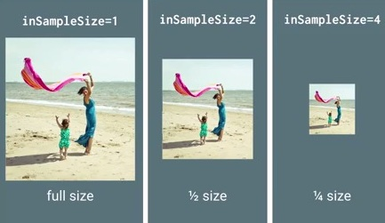

* 色彩压缩：除此之外，还可以通过设置Bitmap图片的Config配置来减少内存使用。配置有以下四种：

  > ALPHA_8（Alpha由8位组成，代表8位Alpha位图）
  >
  > ARGB_4444（由4个4位组成即16位，代表16位ARGB位图）
  >
  > ARGB_8888（由4个8位组成即32位，代表32位ARGB位图，图片质量最佳）
  >
  > RGB_565（R为5位，G为6位，B为5位，共16位，它是没有透明度的）

  如果配置不一样，需要的内存也不同。比如ARGB4444、ARGB8888、RGB565。配置的位数越高，图片质量越佳，当然需要的内存就越多。如果图片不需要透明度，就采用RGB565的配置。通过Bitmap.Config配置，也可以起到压缩图片大小作用。

  在实际中，可以通过以下代码来进行图片转bitmap解码时的Config。

  ```java
          BitmapFactory.Options options = new BitmapFactory.Options();
          options.inPreferredConfig = Bitmap.Config.RGB_565;
          Bitmap bitmap = BitmapFactory.decodeResource(getResources(), R.drawable.ic_menu_add, options);
  ```

* 如果通过在列表中展示缩略图的形式来加载图片，如果需要查看高清图片，另启动一个页面（对话框）来加载高清图片，这样可以避免在列表中加载太多高清图片，减少内存开销。

## 2 内存优化—回收（Recycle）

一些资源时使用时记得回收，比如说**BraodcastReceiver，ContentObserver，File，Cursor，Stream，Bitmap**、**TypeArray**等资源的代码，应该在使用之后或者Activity销毁时及时关闭或者注销，否则这些资源可能将不会被回收，造成内存泄漏。

## 3 内存优化—重用（Reuse）

### 3.1 对象池

在程序里面经常会遇到的一个问题是短时间内创建大量的对象，导致内存紧张，从而触发GC导致性能问题。对于这个问题，我们可以使用对象池技术来解决它。通常对象池中的对象可能是bitmaps，views，messages等等。

比如说Message.obtain()方法。通过handler去发消息Message时，通过Message.obtain()来获得一个消息，就比直接通过new一个Message要更好。因为Message中内部就维护了一个对象池用来存放消息，通过obtain方法来取消息的话，会先从内部的对象池中去取，如果取不到，再去新创建一个消息进行使用。

再比如说线程池。开启新线程来执行任务可以用new Thread()来做，但这样做的弊端如下：

* 每次new Thread新建对象性能差。
* 线程缺乏统一管理，可能无限制新建线程，相互之间竞争，及可能占用过多系统资源导致死机或oom。
* 缺乏更多功能，如定时执行、定期执行、线程中断。

相比new Thread，Java提供的四种线程池的好处在于：

* 重用存在的线程，减少对象创建、消亡的开销，性能佳。
* 可有效控制最大并发线程数，提高系统资源的使用率，同时避免过多资源竞争，避免堵塞。
* 提供定时执行、定期执行、单线程、并发数控制等功能。

Java通过Executors提供四种线程池，分别为：

- newSingleThreadExecutor 创建一个单线程化的Executor，它只会用唯一的工作线程来执行任务，保证所有任务按照指定顺序(比如FIFO)执行。最大特点是可以保证按照顺序执行各个任务，不会有多个线程是可活动的。
- newScheduledThreadPool 创建一个定长线程池，可控制线程最大并发数，支持定时及周期性任务执行，类似于Timer。
- newFixedThreadPool 创建一个定长线程池，可控制线程最大并发数，超出的线程会在队列中等待。
- newCachedThreadPool 创建一个可缓存的线程池。可创建的最大线程数量没有限制，如果长时间(60秒)没有向线程池中提交新任务，则空闲线程会被终止。

关于对象池的操作原理，请看下面的图示：

 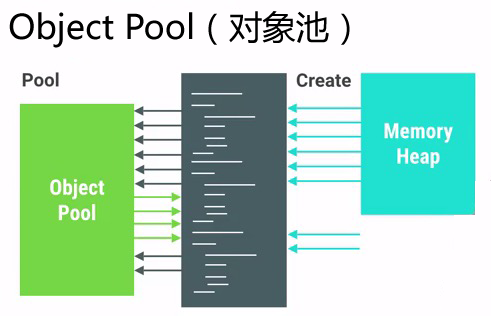

使用对象池技术有很多好处，它可以避免内存抖动，提升性能，但是在使用的时候有一些内容是需要特别注意的。通常情况下，初始化的对象池里面都是空白的，当使用某个对象的时候先去对象池查询是否存在，如果不存在则创建这个对象然后加入对象池。

但是我们也可以在程序刚启动的时候就事先为对象池填充一些即将要使用到的数据，这样可以在需要使用到这些对象的时候提供更快的首次加载速度，这种行为就叫做**预分配**。

使用对象池也有不好的一面，我们需要手动管理这些对象的分配与释放，所以我们需要慎重地使用这项技术，避免发生对象的内存泄漏。为了确保所有的对象能够正确被释放，我们需要保证加入对象池的对象和其他外部对象没有互相引用的关系。

### 3.2 缓存

无论是为了提高CPU的计算速度还是提高数据的访问速度，在绝大多数的场景下，我们都会使用到缓存。

例如缓存到内存里面的图片资源，网络请求返回数据的缓存等等。凡是可能需要反复读取的数据，都建议使用合适的缓存策略。比如图片三级缓存、ListView中的Adapter使用contentView进行复用、使用holder避免重复的findViewById。再比如以下的代码，都是缓存的体现。

```java
        //原代码
        for (int i = 0; i < 1024; i++) {
            if(i<getCount()){
                Log.d("TAG", "some log" + i);
            }
        }

        //有缓存体现的代码，避免重复调用1024次getCount方法
        int count = getCount();
        for (int i = 0; i < 1024; i++) {
            if(i<count){
                Log.d("TAG", "some log" + i);
            }
        }
```

#### 3.2.1 缓存中的lru算法

lru算法（Least Recently Use），即最近最少使用算法，在Android中比较常用。当内存超过限定大小时，凡是近时间内最少使用的那一个对象，就会从缓存容器中被移除掉。

LRU Cache的基础构建用法如下：

```java
        //往缓存中添加图片，PicUrl是图片的地址，将其作为key，bitmap位图则作为value
        bitmapLRUCache.put(picUrl,bitmap);
        //通过picUrl图片地址，从缓存中取bitmap
        bitmapLRUCache.get(picUrl);
```

为了给LRU Cache设置一个比较合理的缓存大小值，我们通常是用下面的方法来做界定的：

```java
        //当前应用最大可用内存
        long maxMemory = Runtime.getRuntime().maxMemory();
        //创建一个LRUCache，设置缓存大小界限为最大可用内存的八分之一
        BitmapLRUCache bitmapLRUCache = new BitmapLRUCache((int)maxMemory / 8);
```

使用LRU Cache时为了能够让Cache知道每个加入的Item的具体大小，我们需要Override下面的方法：

```java
public class BitmapLRUCache extends LruCache<String,Bitmap> {

    public BitmapLRUCache(int maxSize) {
        super(maxSize);
    }

    @Override
    protected int sizeOf(String key, Bitmap value) {
        int byteCount = value.getByteCount();//该bitmap位图所占用的内存字节数
        return byteCount;
    }
}
```

#### 3.2.2 避免创建大量的临时对象

如果创建大量的临时对象，会导致内存上出现抖动。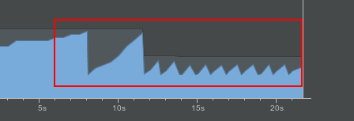

上图为Android Studio中Memory Monitor，图中的波浪线就表示，内存的开销忽上忽下，出现了抖动，此时应用容易出现卡屏掉帧。

为了避免创建大量临时对象，注意：

* 在高频率执行的方法中注意尽量不要创建对象，像View的onTouch和onDraw方法
* 在做较多的字符串拼接时，采用StringBuilder、StringBuffer。

## 4 内存优化—检查（Review）

代码写完了只是个开始。比较规范的编码，都需要Review的。代码检查时的注意点可参考上述内容。

接下来要提到的是UI检查。

### 4.1 查看UI布局是否过度绘制（overdraw）

查看的前提是：移动设备已经开启了**开发者选项**。

在开发者选项中，点击“调试GPU过度绘制”，将弹出对话框，然后选择“显示过度绘制区域”，如下图所示：

 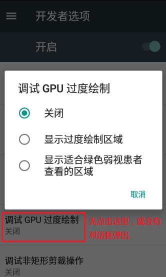

屏幕这时候会变得花花绿绿的. 这些颜色是用来帮助你诊断应用程序的显示行为的。

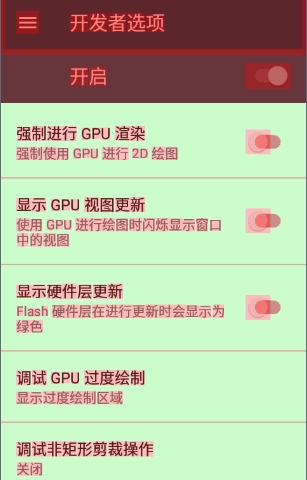

这些颜色用于表示每个像素被重绘的次数, 含义如下：

> 真实颜色: 没有被重绘
>
> 蓝色: 重绘一次
>
> 绿色: 重绘两次
>
> 粉色: 重绘三次
>
> 红色: 重绘四次或更多次 


通过这个工具，可以实现这些事情：

- 展示一个APP在何处做了不必要的渲染绘制。


- 帮助你查看在哪里可以减少渲染绘制。

有些重绘是不可避免的. 尽量调整APP的用户界面, 目标是让大部分的屏幕都是真实的颜色以及重绘一次的蓝色。

PS：Activity是有默认颜色的，如果你已经在Layout文件中给页面设置了颜色，那么Activity的默认颜色可以去掉，这样也能减少一层绘制。

```
		setContentView(R.layout.activity_overdraw_01);
		//设置取消Activity的默认背景色
        getWindow().setBackgroundDrawable(null);
```

### 4.2 查看UI布局的渲染速度

查看的前提是：移动设备已经开启了**开发者选项**。

在开发者选项中，点击“GPU呈现模式分析”，将弹出对话框，然后选择“在屏幕上显示为条形图”，如下图所示：

 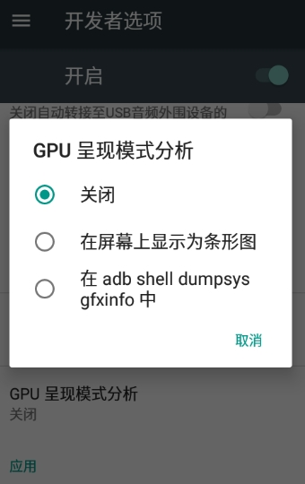

这时，将会在屏幕下方出现条形图，如下图所示：

 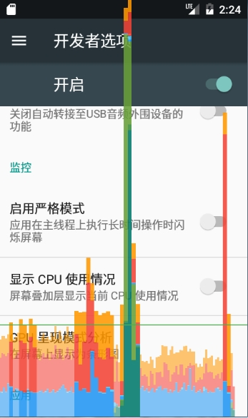

该工具会为每个可见的APP显示一个图表，水平轴即时间流逝, 垂直轴表示每帧经过的时间,单位是毫秒。

在与APP的交互中, 垂直栏会显示在屏幕上, 从左到右移动, 随着时间推移，绘制帧的性能将会迅速体现出来。

绿色的线是用于标记16毫秒的分隔线（PS：人眼的原因, 1秒24帧的动画才能感到顺畅. 所以每帧的时间大概有41ms多一点点(1000ms/24). 但是但是, 注意了, 这41ms不是全都留给你[Java](http://www.07net01.com/tags-Java-0.html)代码, 而是所有java native 屏幕等等的, **最后留给我们用java级别代码发挥的时间, 只有16~17ms**），只要有一帧超过了绿线, 你的APP就会丢失一帧。

### 4.3 查看UI布局的层级和实现方式

有的UI界面写的效率比较低，我们可以通过一些工具来进行UI方面的视图检查。Hierarchy Viewer工具可以展示当前手机界面的View层级。

使用该工具的前提是：只能在模拟器或开发版手机上才能用，普通的商业手机是无法连上的。主要是出于安全考虑，普通商业手机中view server这个服务是没有开启的. Hierarchy Viewer就无法连接到机器获取view层级信息。（PS：如果愿意花功夫捣鼓，也可以在真机上强行开启View Server，详情见[网上资料][http://blog.csdn.net/autumn_xl/article/details/40741835]）

先打开模拟器运行要查看的页面，然后打开Hierarchy Viewer工具，它位于android的sdk所在目录中，具体位置为...\sdk\tools\hierarchyviewer.bat。打开后如图所示：

 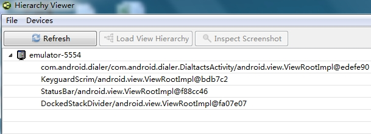

列表展示手机中已打开的页面（包括状态栏等）。这里以电话应用中的DialtactsActivity为例，双击DialtactsActivity，将会打开关于该页面的树状图。如下图所示：

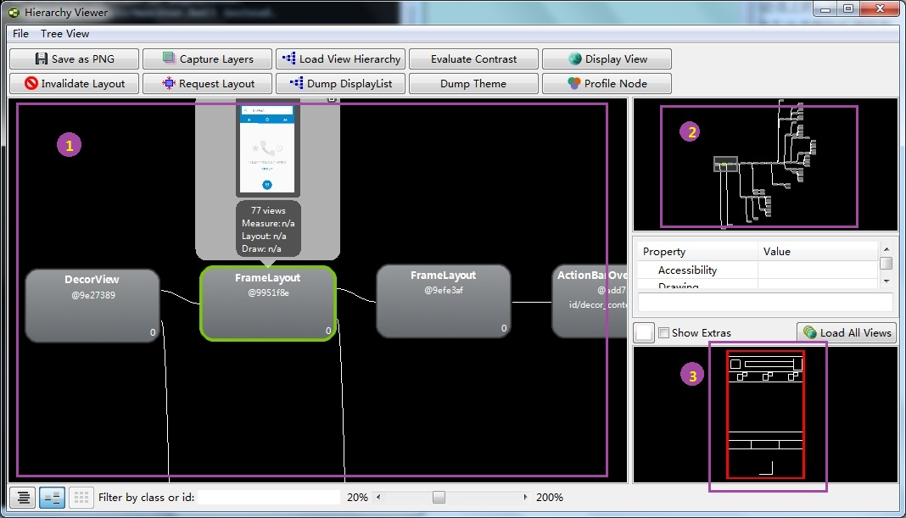

图中标出了3个部分：

- ① Tree View：

  树状图的形式展示该Activity中的View层级结构。可以放大缩小，每个节点代表一个View，点击可以弹出其属性的当前值，并且在LayoutView中会显示其在界面中相应位置。

- ② Tree Overview

  它是Tree View的概览图。有一个选择框， 可以拖动选择查看。选中的部分会在Tree View中显示

- ③ Layout View

  匹配手机屏幕的视图，如果在Tree View中点击了某个节点，呢么这个节点在手机中的真是位置将会在Layout View中以红框的形式被标出。

接下来介绍点击Tree View中某个节点时，它所展示的信息类似于下图：

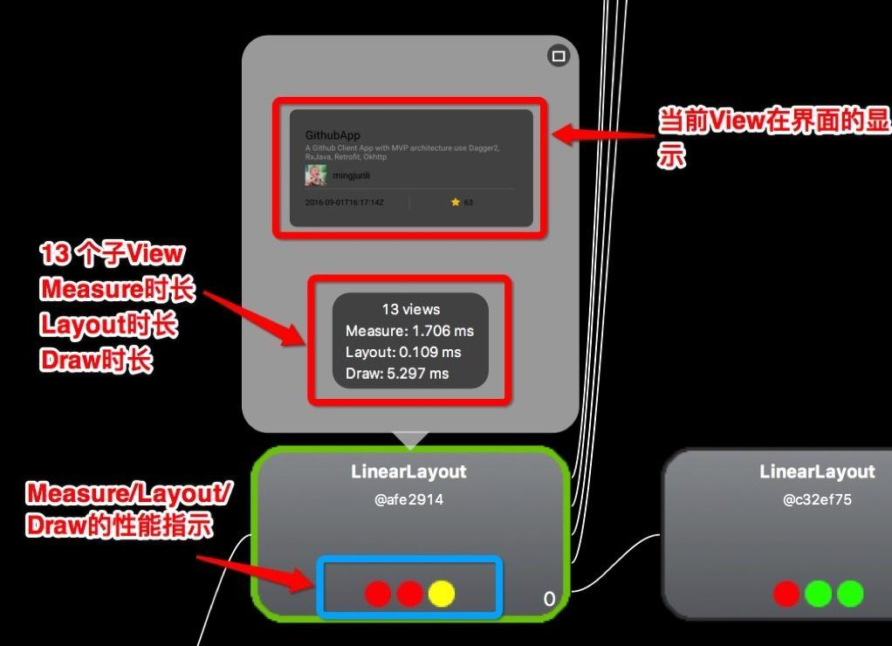

下面的三个圆点，依次表示Measure、Layout、Draw，可以理解为对应View的onMeasure，onLayout，onDraw三个方法的执行速度。

- 绿色：表示该View的此项性能比该View Tree中超过50%的View都要快。
- 黄色：表示该View的此项性能比该View Tree中超过50%的View都要慢。
- 红色：表示该View的此项性能是View Tree中最慢的。

如果界面中的Tree View中红点较多，那就需要注意了。一般的布局可能有以下几点：

1. Measure红点，可能是布局中多次嵌套RelativeLayout，或是嵌套的LinearLayout都使用了weight属性。
2. Layout红点，可能是布局层级太深。
3. Draw红点，可能是自定义View的绘制有问题，复杂计算等。

## 5 UI布局优化

### 5.1 避免过度绘制(Overdraw)

### 5.2 减少布局层级

* 尽量减少嵌套，去除不必要的父布局。
* 尽量不要在RelativeLayout中嵌套使用RelativeLayout，相对布局它会有两次测量Measure两次layout。
* LinearLayout使用Weight属性时，效率会降低至相对布局一样，出现多次测量Measure和布局Layout，所以尽量不要在LinearLayout嵌套LinearLayout时，两个都使用weight属性
* 善用TextView、EditText等控件的Drawable属性来减少布局。

### 5.3 复用（id、style）

### 5.4 使用include、merge、viewStub标签 

#### 5.4.1 include标签

include标签常用于将布局中的公共部分提取出来供其他layout共用，以实现布局模块化，这在布局编写上提供了大大的便利。

下面以在一个布局main.xml中用include引入另一个布局foot.xml为例。main.mxl代码如下

```xml
<?xml version="1.0" encoding="utf-8"?>
<RelativeLayout xmlns:android="http://schemas.android.com/apk/res/android"
    android:layout_width="match_parent"
    android:layout_height="match_parent" >
    <ListView
        android:id="@+id/simple_list_view"
        android:layout_width="match_parent"
        android:layout_height="match_parent"
        android:layout_marginBottom="@dimen/dp_80" />
    <include layout="@layout/foot.xml" />
</RelativeLayout>
```

 其中include引入的foot.xml为公用的页面底部，foot.xml代码如下

```xml
<?xml version="1.0" encoding="utf-8"?>
<RelativeLayout xmlns:android="http://schemas.android.com/apk/res/android"
    android:layout_width="match_parent"
    android:layout_height="match_parent" >
    <Button
        android:id="@+id/button"
        android:layout_width="match_parent"
        android:layout_height="@dimen/dp_40"
        android:layout_above="@+id/text"/>
    <TextView
        android:id="@+id/text"
        android:layout_width="match_parent"
        android:layout_height="@dimen/dp_40"
        android:layout_alignParentBottom="true"
        android:text="@string/app_name" />
</RelativeLayout>
```

`<include>`标签唯一需要的属性是layout属性，指定需要包含的布局文件。在该标签中，还可以定义android:id和android:layout_*属性来覆盖被引入布局根节点的对应属性值。注意重新定义android:id后，子布局的顶结点i就变化了。

#### 5.4.2 merge标签 

在使用了include后可能导致布局嵌套过多，多余不必要的layout节点，从而导致解析变慢，不必要的节点和嵌套可通过上文中提到的hierarchy viewer来查看。而`merge`标签可以消除那些include时不必要的layout节点。

`merge`标签可用于两种典型情况：

1. 布局顶结点是FrameLayout且不需要设置background或padding等属性，可以用merge代替，因为Activity内容试图的parent view就是个FrameLayout，所以可以用merge消除只剩一个。
2. 某布局作为子布局被其他布局include时，使用merge当作该布局的顶节点，这样在被引入时顶结点会自动被忽略，而将其子节点全部合并到主布局中

以上一节中的`<include>`标签的示例为例，用hierarchy viewer查看main.xml布局如下图：

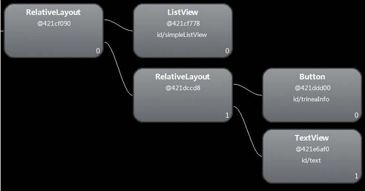

可以发现多了一层没必要的RelativeLayout，将foot.xml中RelativeLayout改为merge，如下：

```xml
<?xml version="1.0" encoding="utf-8"?>
<merge xmlns:android="http://schemas.android.com/apk/res/android"
    android:layout_width="match_parent"
    android:layout_height="match_parent" >
    <Button
        android:id="@+id/button"
        android:layout_width="match_parent"
        android:layout_height="@dimen/dp_40"
        android:layout_above="@+id/text"/>
    <TextView
        android:id="@+id/text"
        android:layout_width="match_parent"
        android:layout_height="@dimen/dp_40"
        android:layout_alignParentBottom="true"
        android:text="@string/app_name" />
</merge>
```

运行后再次用hierarchy viewer查看main.xml布局如下图：

 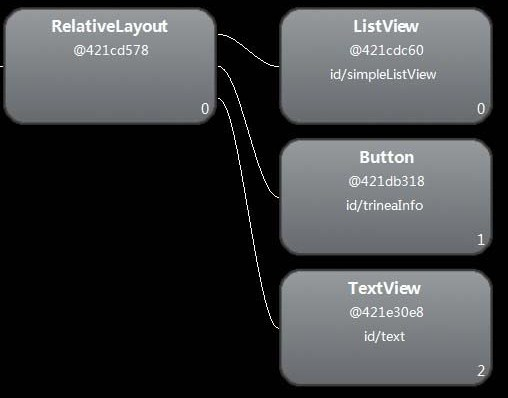

这样就不会有多余的RelativeLayout节点了。

#### 5.4.3 viewStub标签

viewstub标签同include标签一样可以用来引入一个外部布局，不同的是，viewstub引入的布局默认不会扩张，即既不会占用显示也不会占用位置，从而在解析layout时节省cpu和内存。

viewstub常用来引入那些默认不会显示，只在特殊情况下显示的布局，如进度布局、网络失败显示的刷新布局、信息出错出现的提示布局等。

下面以在一个布局main.xml中加入网络错误时的提示页面network_error.xml为例。main.mxl代码如下：

```xml
<?xml version="1.0" encoding="utf-8"?>
<RelativeLayout xmlns:android="http://schemas.android.com/apk/res/android"
    android:layout_width="match_parent"
    android:layout_height="match_parent" >
	……
    <ViewStub
        android:id="@+id/network_error_layout"
        android:layout_width="match_parent"
        android:layout_height="match_parent"
        android:layout="@layout/network_error" />
</RelativeLayout>
```

其中network_error.xml为只有在网络错误时才需要显示的布局，默认不会被解析，示例代码如下：

```xml
<?xml version="1.0" encoding="utf-8"?>
<RelativeLayout xmlns:android="http://schemas.android.com/apk/res/android"
    android:layout_width="match_parent"
    android:layout_height="match_parent" >
    <Button
        android:id="@+id/network_setting"
        android:layout_width="@dimen/dp_160"
        android:layout_height="wrap_content"
        android:layout_centerHorizontal="true"
        android:text="@string/network_setting" />
    <Button
        android:id="@+id/network_refresh"
        android:layout_width="@dimen/dp_160"
        android:layout_height="wrap_content"
        android:layout_below="@+id/network_setting"
        android:layout_centerHorizontal="true"
        android:layout_marginTop="@dimen/dp_10"
        android:text="@string/network_refresh" />
</RelativeLayout>
```

在java中通过(ViewStub)findViewById(id)找到ViewStub，通过stub.inflate()展开ViewStub，然后得到子View，如下

```java
private View networkErrorView;
private void showNetError() {
	// not repeated infalte
	if (networkErrorView != null) {
		networkErrorView.setVisibility(View.VISIBLE);
		return;
	}
	ViewStub stub = (ViewStub)findViewById(R.id.network_error_layout);
	networkErrorView = stub.inflate();
	Button networkSetting = (Button)networkErrorView.findViewById(R.id.network_setting);
	Button refresh = (Button)findViewById(R.id.network_refresh);
}
private void showNormal() {
	if (networkErrorView != null) {
		networkErrorView.setVisibility(View.GONE);
	}
}
```

 在上面showNetError()中展开了ViewStub，同时我们对networkErrorView进行了保存，这样下次不用继续inflate。

上面展开ViewStub部分代码

```java
ViewStub stub = (ViewStub)findViewById(R.id.network_error_layout);
networkErrorView = stub.inflate();
```

也可以写成下面的形式

```java
View viewStub = findViewById(R.id.network_error_layout);
viewStub.setVisibility(View.VISIBLE);   // ViewStub被展开后的布局所替换
networkErrorView =  findViewById(R.id.network_error_layout); // 获取展开后的布局
```

两者效果一致，只是不用显示的转换为ViewStub。通过viewstub的原理我们可以知道将一个view设置为GONE不会被解析，从而提高layout解析速度，而VISIBLE和INVISIBLE这两个可见性属性会被正常解析。

### 5.5 使用Spannable或Html.fromHtml

举例说明，比如下图中红框标出来的效果：


比较笨的方法就是使用多个TextView，然后设置不同的字体及颜色。

其实用一个TextVIew就可以实现，类似如下代码

```java
 String text = String.format("￥%1$s  门市价:￥%2$s", 18.6, 22);
 int z = text.lastIndexOf("门");
 SpannableStringBuilder style = new SpannableStringBuilder(text);
 style.setSpan(new AbsoluteSizeSpan(DisplayUtil.dip2px(mContext,14)), 0, 1, Spannable.SPAN_EXCLUSIVE_INCLUSIVE); //设置第一个符号的字号
 style.setSpan(new ForegroundColorSpan(Color.parseColor("#afafaf")), z, text.length(), Spannable.SPAN_EXCLUSIVE_INCLUSIVE); //设置门市价那段文本的字体的颜色
 style.setSpan(new AbsoluteSizeSpan(DisplayUtil.dip2px(mContext,14)), z, text.length(), Spannable.SPAN_EXCLUSIVE_INCLUSIVE); //设置门市价那段文本的字体的字号

 tv.setText(style);
```

